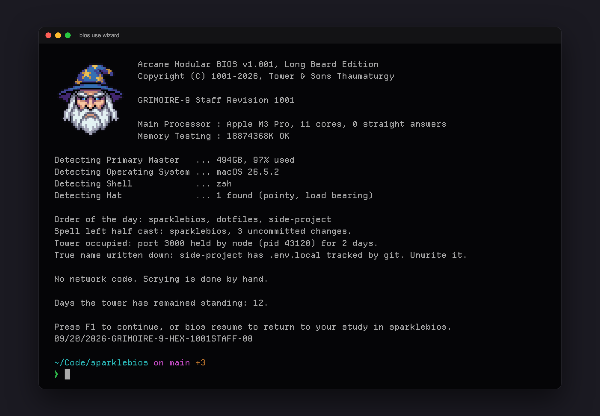
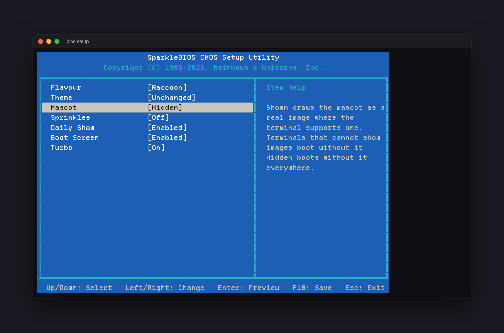
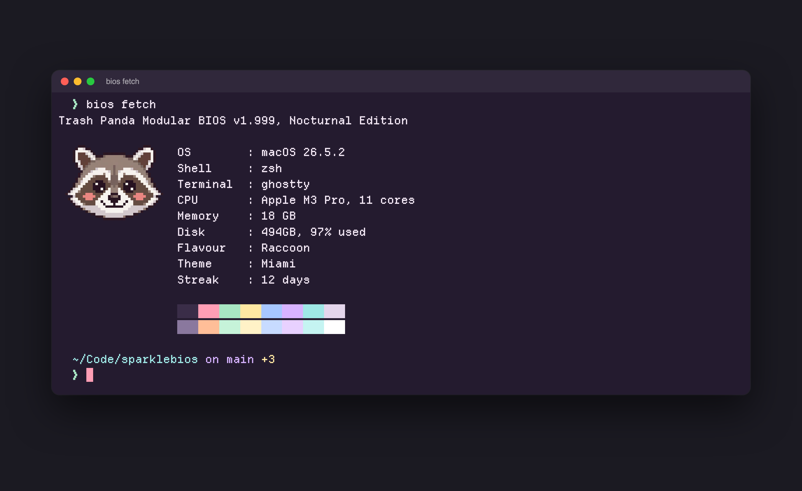
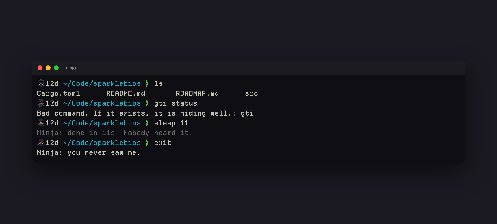

<p align="center">
  
</p>

<p align="center">
  <strong>Boot every terminal tab like a 1995 PC. It counts your RAM, detects a unicorn, and runs a real health check.</strong>
</p>

<p align="center">
  <a href="https://github.com/reactivepixels/sparklebios/actions/workflows/post.yml"></a>
  
  
  
  
  
</p>

# SparkleBIOS

Every new terminal tab boots. The screen is period correct, takes milliseconds,
and every line on it is true: that is your real processor, your real disk, your
real shell, and one fictional horn.

Sparkle Corp shipped its first BIOS in 1985. The one on your screen is the 1995 model. The first tab of the day plays the whole thing, about three seconds. Every tab after that gets the finished screen in a few milliseconds.

<p align="center">
  
</p>

## Install

Homebrew, on macOS or Linux:

```
brew install reactivepixels/tap/sparklebios
```

With a Rust toolchain:

```
cargo install sparklebios
```

Or take a prebuilt binary for your platform from the
[latest release](https://github.com/reactivepixels/sparklebios/releases/latest).
Every release ships macOS and Linux builds for both Intel and ARM, with
checksums.

Try it first, without touching your shell: `bios boot --flavour sumo`.

Add this line to the END of your `~/.zshrc`, then open a new tab. It boots.

```
command -v bios >/dev/null 2>&1 && eval "$(bios init zsh)"
```

Bash, in `~/.bashrc`:

```
command -v bios >/dev/null 2>&1 && eval "$(bios init bash)"
```

Fish, in `~/.config/fish/config.fish`:

```
command -v bios >/dev/null 2>&1; and bios init fish | source
```

## Flavours

One screen, swappable personality. A flavour supplies the mascot, the firmware,
the vendor, the one part of it a BIOS would detect, and a pool of rotating quips.

```
bios flavours            # what is available
bios boot --flavour sumo # preview one
bios use sumo            # make it permanent
```

<p align="center">
  
  
</p>

<p align="center">
  
  
</p>

<p align="center">
  
  
</p>

<p align="center">
  
  
</p>

| Flavour | The BIOS detects | It says things like |
|---|---|---|
| `unicorn` | Horn: 1 found (7-band, sparkle capable) | Warning: horn is not hot-swappable. |
| `sumo` | Salt: 1 handful (thrown) | Process priority: heavyweight. |
| `ninja` | Ninja: not found (as expected) | Floppy drive A: vanished in a puff of smoke. |
| `viking` | Horns: 2 found (historically inaccurate) | Beard integrity: excellent. |
| `luchador` | Mask: 1 found (never removed) | Process pinned. One, two, three. |
| `yeti` | Yeti: 1 found (blurry) | Footprint detected. Size 27. Not yours. |
| `raccoon` | Trash: located (smells promising) | Hands washed. Evidence also washed. |
| `wizard` | Hat: 1 found (pointy, load bearing) | Floppy drive A: transmuted. Now a toad. |

A flavour is one TOML file and one sprite, so adding yours needs no Rust. See
[docs/flavours.md](docs/flavours.md).

`bios use random` boots a different one of them every day, the same one in
every tab, and never the one from the day before.

## SETUP

Every option lives in one blue screen, as nature intended.

```
bios setup
```

Arrow keys move and change, Enter previews the boot screen with your pending
choices, F10 saves, Esc leaves. Nothing is written until you save.

The same options live in `~/.config/sparklebios/config.toml`; `bios config edit` opens it.

<p align="center">
  
</p>

## Themes

"Rainbows and Unicorns" is a Ghostty theme in ten variants. The name is the
only joke in it: contrast is checked, and a test fails if a theme file and its
documentation ever disagree.

```
bios theme list          # the ten
bios theme use miami     # install them and switch Ghostty to one
```

`bios theme install` puts the files in place without switching.

<p align="center">
  
</p>

Beside the themes, in [extras/](extras/README.md): a cursor trail shader, tool
colours for `ls`, `bat`, `fzf`, `delta` and friends that follow whichever variant
you run, and matching starship palettes. All optional.

## Fetch

`bios fetch` prints the machine at a glance: the mascot, a column of facts and the palette. It is the screen you paste into a thread.

<p align="center">
  
</p>

## The show

Once a day the boot is animated: the memory count ticks up and each device is
detected in turn. Press any key to skip it. Whatever you typed during the show
is waiting on your prompt when it ends, and the terminal is never left in a
strange state. Every other boot is drawn instantly.

Where the terminal can draw images (Ghostty, kitty, iTerm2, WezTerm) the
mascot is a real image. Everywhere else, no mascot shows: nothing is reserved
for it, and the rest of the screen sits flush left in its place.

## Sprinkles

Off by default, because not everyone wants sprinkles.

```
bios sprinkles light     # a shimmer, a twinkle, a stripe sweep on a streak
bios sprinkles full      # light, plus the POST beep and beep codes
bios sprinkles ultra     # full, plus sound and reactions all day long
```

`ultra` keeps going after the boot: sound, a screensaver, and the flavour
reacting to your day. Off unless you ask. One command comes with it:

```
bios screensaver         # bounce the logo around until you press a key
```

`bios turbo` toggles the Turbo button. It does nothing. It never did.

`light` and `full` only ever run in the once-a-day animated show, and
sprinkles never flash. See [docs/sprinkles.md](docs/sprinkles.md).

## It stays in character

The boot is the introduction. The flavour keeps talking, a little. It sets
your tab title, comments on a command that ran long, answers a typo instead
of the shell's own message, and says goodbye when the shell exits. Nothing
here spawns a process: your shell already holds every word it will say, from
the moment it started. See [docs/presence.md](docs/presence.md).

<p align="center">
  
</p>

## The jokes are true

Every line on the screen is backed by a real probe. These ship today.

| The screen says | It means |
|---|---|
| Boot device order: eko-pro, sparklebios, klang-stack | The three projects you worked in most recently |
| Primary boot device not parked: eko-pro, 3 uncommitted changes. | You walked away from that one mid-change. `bios resume` goes back to it |
| IRQ conflict: port 3000 held by node (pid 4821) for 3 days. | A dev server you forgot about is still holding a port |
| Virus scan: eko-pro has .env.local tracked by git. Quarantine advised. | git is tracking a file that looks like a secret |

Nothing slow runs while your shell is starting. The probes run in a detached
process afterwards, and the boot screen reads the result from a cache.

Every check is cached and phrased by your flavour. `bios refresh` runs them again now.

## Principles

1. **Be cool and hilarious.** That is the mandate. The rulebook is [docs/voice.md](docs/voice.md).
2. **Never slow or break the shell.** Under 30ms of work before the first frame. A failure prints nothing and exits 0. One environment variable turns it all off.
3. **Jokes carry facts.** Every gag line is backed by a real probe.
4. **Quantised, not gradient.** Three to sixteen colours and hard edges.
5. **Each flavour speaks in its own voice.** The same warning reads differently from a unicorn and from a sumo.
6. **Content is data.** Flavours, themes and gags are files, not code.
7. **No network.** There is no network code in this project and there never will be.

## Roadmap

Milestones and what is done live in [ROADMAP.md](ROADMAP.md).

The rest of the paperwork is in [the manual](docs/README.md).

## Add your childhood mascot

Start with `bios flavour new <id>`: it writes a starter flavour file, ready
to boot before you have changed a word. A flavour is one TOML file and one
sprite: a mascot, some firmware wording, the one part of it a BIOS would
detect, and a handful of deadpan quips. If the creature or object you grew up
with is not on the list, it should be. The format is in
[docs/flavours.md](docs/flavours.md), the tone is in
[docs/voice.md](docs/voice.md), and [CONTRIBUTING.md](CONTRIBUTING.md) has the
house rules. If you would rather not write TOML, open an issue and tell me what
the BIOS should detect.

## Questions people ask

**Will it slow my shell?** It has a time budget, and CI measures it against that
budget on every push. On an Apple M3 Pro a new tab costs four to six
milliseconds, process start included, and roughly half of that is what starting
any program at all costs. The budget CI enforces is 30ms. It spawns nothing and waits for nothing. The measurements are in
[docs/speed.md](docs/speed.md).

**Does it phone home?** No. See principle 7. In 1985 there was nothing to phone.

**How do I turn it off?** `SPARKLEBIOS_BOOT=0`, or remove one line from your
shell config. The hook is guarded, so uninstalling the binary cannot break
your shell either.

**Can I skip the show?** Press any key. Whatever you typed is waiting on your prompt when it ends.

**Where did I leave off?** The boot screen lists your recent projects as boot
devices and names the one you walked away from mid-change. `bios resume` takes
you back to it.

**No mascot?** Your terminal cannot show images. Ghostty, kitty, iTerm2 and
WezTerm can.

## System requirements

- A terminal.
- 640K of RAM (ought to be enough for anybody).
- One (1) unicorn. Supplied.

Warranty void if horn is removed. Horn is not hot-swappable.

In practice: macOS or Linux; zsh, bash or fish; and, if you want the mascot, a terminal that draws images (Ghostty, kitty, iTerm2, WezTerm). Everything else works in any terminal.

## License

Licensed under either of [Apache License 2.0](LICENSE-APACHE) or
[MIT license](LICENSE-MIT) at your option.

Known issues: none. Known unicorns: 1.
