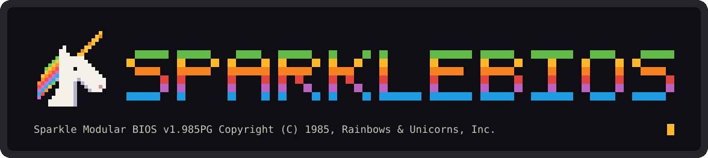
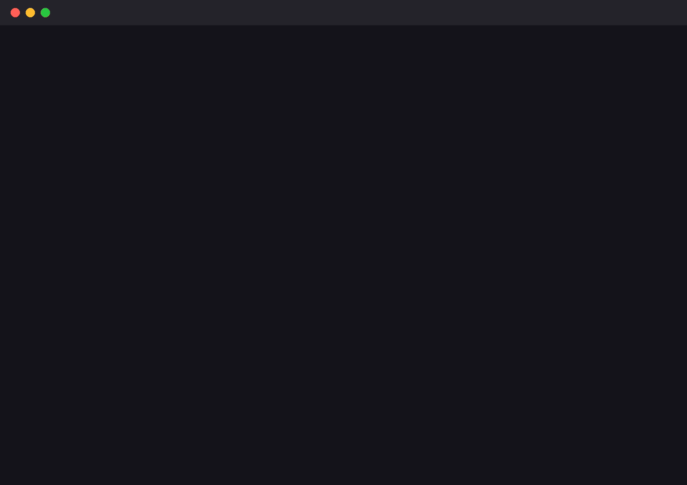
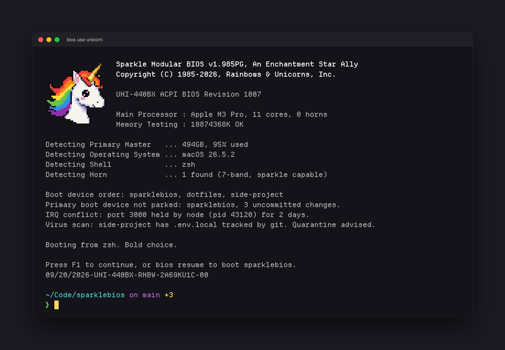
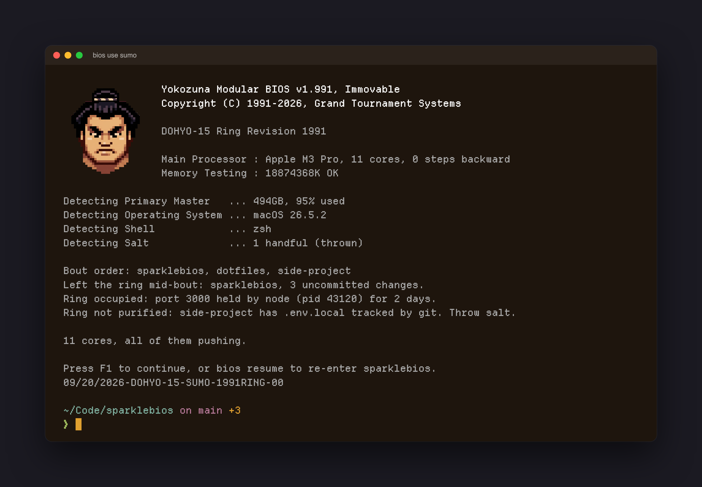
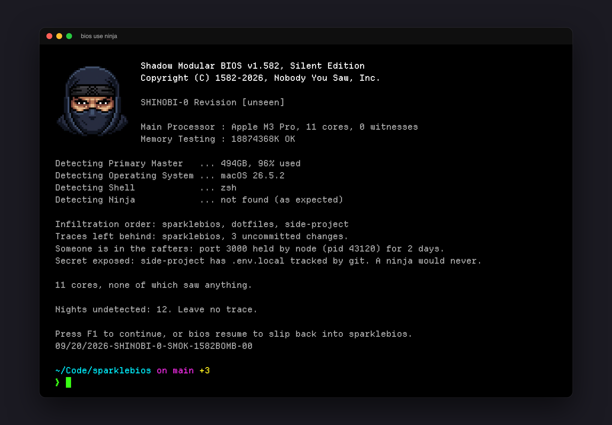
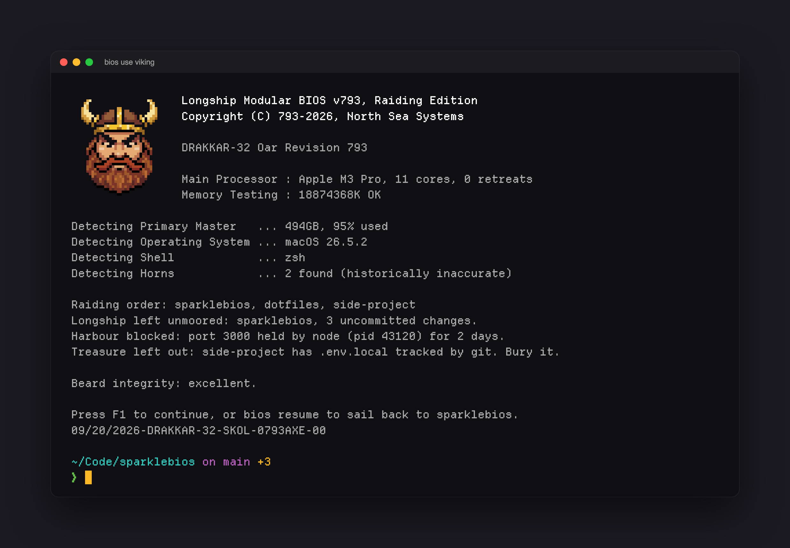
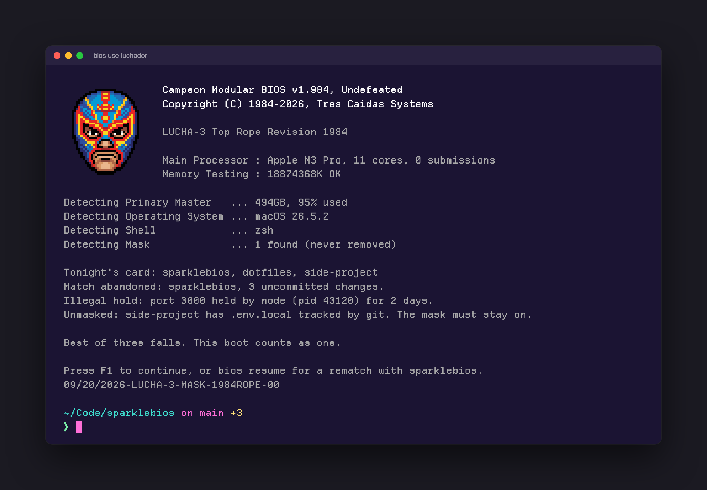
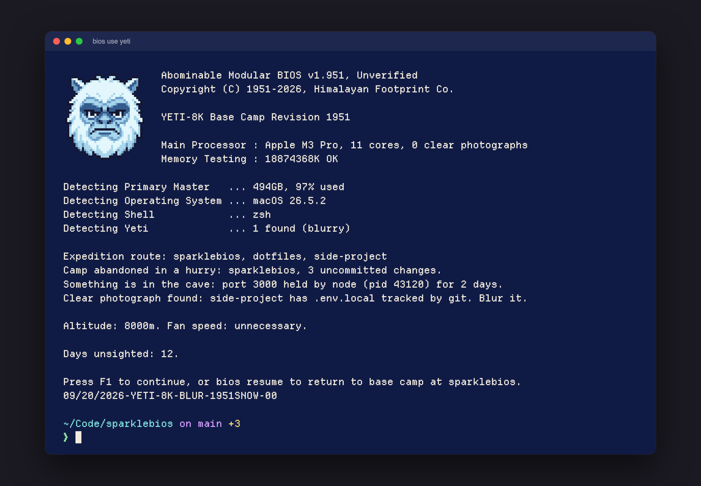
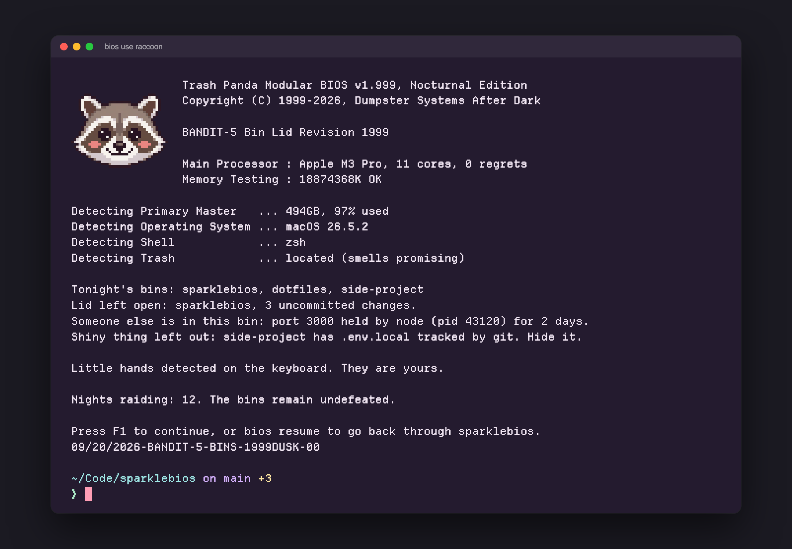
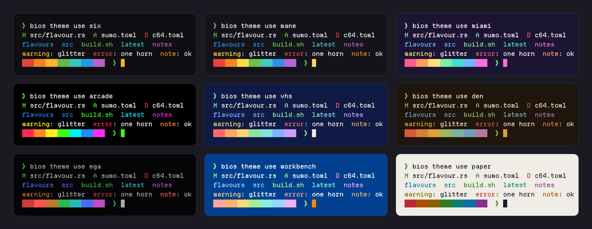

<p align="center">
  
</p>

<p align="center">
  <strong>Boot every terminal tab like a 1995 PC. It counts your RAM, detects a unicorn, and runs a real health check.</strong>
</p>

<p align="center">
  <a href="https://github.com/reactivepixels/sparklebios/actions/workflows/post.yml"></a>
  
  
  
  
  
</p>

# SparkleBIOS

Every new terminal tab boots. The screen is period correct, takes milliseconds,
and every line on it is true: that is your real processor, your real disk, your
real shell, and one fictional horn.

<p align="center">
  
</p>

> **Status: pre-alpha, and usable every day.** The boot screen, flavours, themes
> and the animated show all work from source on macOS. The first three health
> checks have landed: boot device order, IRQ conflicts and the virus scan.

## Install from source

```
cargo install --git https://github.com/reactivepixels/sparklebios
```

Add this line to the END of your `~/.zshrc`, then open a new tab. It boots.

```
command -v bios >/dev/null 2>&1 && eval "$(bios init zsh)"
```

Bash, in `~/.bashrc`:

```
command -v bios >/dev/null 2>&1 && eval "$(bios init bash)"
```

Fish, in `~/.config/fish/config.fish`:

```
command -v bios >/dev/null 2>&1; and bios init fish | source
```

To try it without touching your shell: `bios boot`

## Flavours

One screen, swappable personality. A flavour supplies the mascot, the firmware,
the vendor, the one part of it a BIOS would detect, and a pool of rotating quips.

```
bios flavours            # what is available
bios boot --flavour sumo # preview one
bios use sumo            # make it permanent
```

<p align="center">
  
  
</p>

<p align="center">
  
  
</p>

<p align="center">
  
  
</p>

<p align="center">
  
</p>

| Flavour | The BIOS detects | It says things like |
|---|---|---|
| `unicorn` | Horn: 1 found (7-band, sparkle capable) | Warning: horn is not hot-swappable. |
| `sumo` | Salt: 1 handful (thrown) | Process priority: heavyweight. |
| `ninja` | Ninja: not found (as expected) | Floppy drive A: vanished in a puff of smoke. |
| `viking` | Horns: 2 found (historically inaccurate) | Beard integrity: excellent. |
| `luchador` | Mask: 1 found (never removed) | Process pinned. One, two, three. |
| `yeti` | Yeti: 1 found (blurry) | Footprint detected. Size 27. Not yours. |
| `raccoon` | Trash: located (smells promising) | Hands washed. Evidence also washed. |

A flavour is one TOML file and one sprite, so adding yours needs no Rust. See
[docs/flavours.md](docs/flavours.md).

## Themes

"Rainbows and Unicorns" is a Ghostty theme in ten variants. The name is the
only joke in it: contrast is checked, and a test fails if a theme file and its
documentation ever disagree.

```
bios theme list          # the ten
bios theme use miami     # install them and switch Ghostty to one
```

<p align="center">
  
</p>

Beside the themes, in [extras/](extras/README.md): a cursor trail shader, tool
colours for `ls`, `bat`, `fzf`, `delta` and friends that follow whichever variant
you run, and matching starship palettes. All optional.

## The show

Once a day the boot is animated: the memory count ticks up and each device is
detected in turn. Press any key to skip it. Whatever you typed during the show
is waiting on your prompt when it ends, and the terminal is never left in a
strange state. Every other boot is drawn instantly.

Where the terminal can draw images (Ghostty, kitty) the mascot is a real
image. Everywhere else, no mascot shows: nothing is reserved for it, and the
rest of the screen sits flush left in its place.

## Sprinkles

Off by default, because not everyone wants sprinkles. Turn it on with `bios
sprinkles light` (a shimmer, a twinkle, and a stripe sweep on a streak
milestone) or `bios sprinkles full` (the same, plus the POST beep and beep
codes). Sprinkles only ever run in the animated show, never flash, and cost
nothing when off. See [docs/sprinkles.md](docs/sprinkles.md).

## The jokes are true

Every line on the screen is backed by a real probe. These ship today.

| The screen says | It means |
|---|---|
| Boot device order: eko-pro, sparklebios, klang-stack | The three projects you worked in most recently |
| Primary boot device not parked: eko-pro, 3 uncommitted changes. | You walked away from that one mid-change. `bios resume` goes back to it |
| IRQ conflict: port 3000 held by node (pid 4821) for 3 days. | A dev server you forgot about is still holding a port |
| Virus scan: eko-pro has .env.local tracked by git. Quarantine advised. | git is tracking a file that looks like a secret |

Nothing slow runs while your shell is starting. The probes run in a detached
process afterwards, and the boot screen reads the result from a cache.

Still to come: a disk filling up, a changed `.zshrc`, stashes you forgot, a slow
shell and a low battery.

## Principles

1. **Be cool and hilarious.** That is the mandate. The rulebook is [docs/voice.md](docs/voice.md).
2. **Never slow or break the shell.** Under 30ms of work before the first frame. A failure prints nothing and exits 0. One environment variable turns it all off.
3. **Jokes carry facts.** Every gag line is backed by a real probe.
4. **Quantised, not gradient.** Three to sixteen colours and hard edges.
5. **Each flavour speaks in its own voice.** The same warning reads differently from a unicorn and from a sumo.
6. **Content is data.** Flavours, themes and gags are files, not code.
7. **No network.** There is no network code in this project and there never will be.

## Roadmap

| # | Milestone | Status |
|---|---|---|
| M0 | The theme: ten Ghostty theme variants, `bios theme use` | done |
| M1 | BIOS skeleton: shell hook, boot modes, static POST screens | done |
| M2 | The look and the show: the mascot as a real image, animation, skip keys, typeahead preserved | done |
| M2.5 | Flavours: `unicorn` and `sumo`, with more mascots to come | done |
| M3 | Health checks: boot device order, IRQ conflicts, the virus scan | done |
| M3.5 | More checks: disk trend, changed dotfiles, stale stashes, battery, beep codes | planned |
| M4 | Sprinkles: optional sound and text effects, off by default, and `bios config edit` | planned |
| M4.5 | neigh, the rainbow pipe | planned |
| M5 | `bios setup` | planned |
| M6 | Project POST when you `cd` into a repo | planned |
| M7 | More flavours | planned |
| M8 | Launch readiness: Linux, bash and fish, `bios fetch`, prebuilt binaries | planned |

Details live in [ROADMAP.md](ROADMAP.md), and the rest of the paperwork is in [the manual](docs/README.md).

## Add your childhood mascot

A flavour is one TOML file and one sprite: a mascot, some firmware wording, the
one part of it a BIOS would detect, and a handful of deadpan quips. If the
creature or object you grew up with is not on the list, it should be. The format
is in [docs/flavours.md](docs/flavours.md), the tone is in
[docs/voice.md](docs/voice.md), and [CONTRIBUTING.md](CONTRIBUTING.md) has the
house rules. If you would rather not write TOML, open an issue and tell us what
the BIOS should detect.

## Questions people ask

**Will it slow my shell?** It has a time budget and the budget is tested. Measured
on an Apple M3 Pro: 2.5ms for a whole boot, process start included. It spawns
nothing and waits for nothing.

**Does it phone home?** No. See principle 7. In 1985 there was nothing to phone.

**How do I turn it off?** `SPARKLEBIOS_BOOT=0`, or remove one line from your
shell config. The hook is guarded, so uninstalling the binary cannot break
your shell either.

**Can I skip the show?** Press any key. Whatever you typed is waiting on your prompt when it ends.

**Where did I leave off?** The boot screen lists your recent projects as boot
devices and names the one you walked away from mid-change. `bios resume` takes
you back to it.

**No mascot?** Your terminal cannot show images. Ghostty and kitty can.

## System requirements

- A terminal.
- 640K of RAM (ought to be enough for anybody).
- One (1) unicorn. Supplied.

Warranty void if horn is removed. Horn is not hot-swappable.

## License

Licensed under either of [Apache License 2.0](LICENSE-APACHE) or
[MIT license](LICENSE-MIT) at your option.

Known issues: none. Known unicorns: 1.
